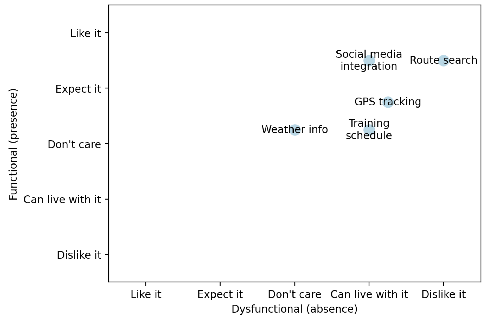

# Kano model
This is an all-in-one app that can be used to survey users and create a Kano model from the survey results. The goal was to create that does not require another app (eg Google forms) to administer a survey, and would make it easy to create a Kano model from the survey results.



## Survey
This survey app collects the users's preferences about product feature but asking how they would rate a feature when is present and when it is absent. Present and absent map to functional and dysfunctional in Kano's model. I could not find a simple survey application in streamlit that could write the survey results to a file, so I wrote one.

## Kano
The kano app reads survey data and produces a Kano model. The y-axis shows the average rating of a feature when it is present in the product (functional), and the x-axis the average rating of a feature when it is absent from the product (dysfunctional). The rating is on a scale from Like it to Dislike it. For more information about the Kano model, see [Kano model](https://en.wikipedia.org/wiki/Kano_model).

# Installation
Running the apps requires that the [streamlit](http://streamlit.io) library is installed.

You also need to set the HOST and PORT parameters in kano.py to you match your configuration. These parameters are used to create a link to the survey.

# Usage
Start the Survey app on one port (default: 8501) and the Kano app on another port (default: 8502) using the following commands:

```
streamlit run survey.py --server.port 8501 &
streamlit run kano.py --server.port 8502 &
```

Use the Kano app to create your first survey. Simply enter the name of the survey, then one feature per line, and submit the survey. Done.

Next, use the "Take a survey" link to connect to the Survey app. Share this survey link with your users and ask them to complete the survey questions.

Once you have some survey data, you can produce a Kano model in the Kano app. If the survey name is not already set, enter the name of the survey to load it. To update an existing Kano model as you add survey data, click the "Refresh" button.